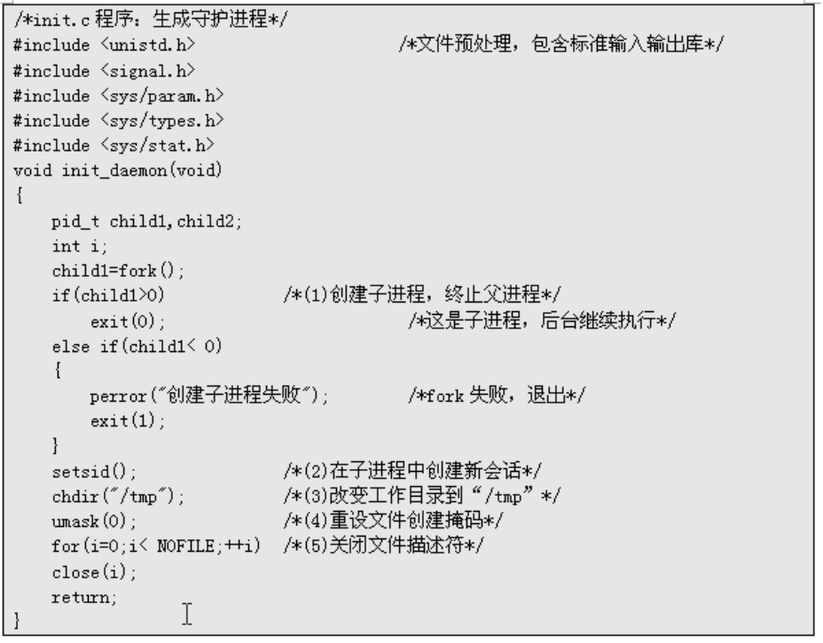

**实验目的和要求：**

进程的基本概念及进程的结构Linux环境下进程的相关函数的应用守护进程的概念、启动和建立进程控制程序的编写

**实验条件：**

1、装有Linux操作系统的微型计算机；

## 实验过程

Liunx进程创建

****

****

****

****

****

僵尸进程

****

****

守护进程

****

****

****

\*\*  
\*\*

## 实验结果分析

1、熟悉并记录命令执行结果。

2、写出自己的心得体会。3. 实验报告仅提供封面，不提供正文模板。实验报告要求如下：

1）至少包含实验过程、实验结果、选择部分度量项目对结果进行简要解释。

2）报告章节要组织合理。**核心思想是：通过你的报告能够让初学者可以很快掌握Linux下的进程启动调用，类似做一个教程，当你把自己的成果放到百度文库，能够帮助更多的人。**
