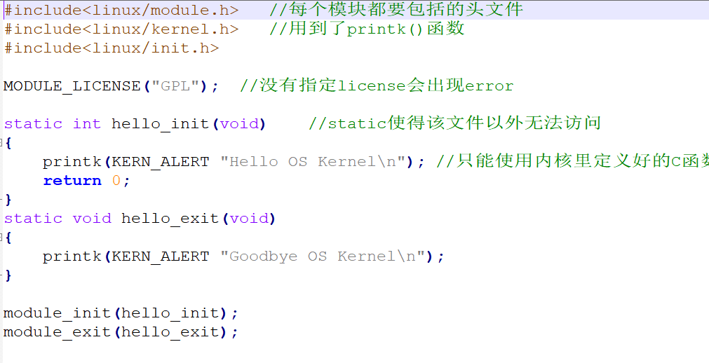

**实验目的和要求：**

1结合Linux系统调用进一步理解malloc2 学习内核模块编程技术3理解并实践内存缺页相关知识

**实验条件：**

1、装有Linux操作系统的微型计算机；

## 实验过程

1 操作系统的发展使得系统完成了大部分的内存管理工作。对于程序员而言，这些内存管理的过程完全透明不可见。因此，程序员开发时从不关心系统如何为自己分配内存，而且永远认为系统可以分配给程序所需要的内存。在程序开发时，程序员真正需要做的就是：申请内存、使用内存、释放内存，其他一概无需过问。

#### 在Linux 下，用malloc（）函数实现cat或copy命令。实验2：编程环境

Ubuntu 16.04 LTS

#### 什么是模块

内核模块的全称是动态可加载内核模块(Loadable Kernel Modul,KLM)，可以动态载入内核，让它成为内核代码的一部分。

一个模块一般由一组函数和数据结构组成。

**hello.c代码**如下

 **Makefile代码**如下

在

在命令行输入：

观察CR3寄存器

**  
**

## 实验结果分析

1、熟悉并记录命令执行结果。

2、写出自己的心得体会。3. 实验报告仅提供封面，不提供正文模板。实验报告要求如下：

1）至少包含实验过程、实验结果、选择部分度量项目对结果进行简要解释。

2）报告章节要组织合理。

**核心思想是：根据参考案例，结合教材，了解makefile。结合操作系统的知识，解读最后一个案例中cr3的返回值，并撰写实验报告。**
