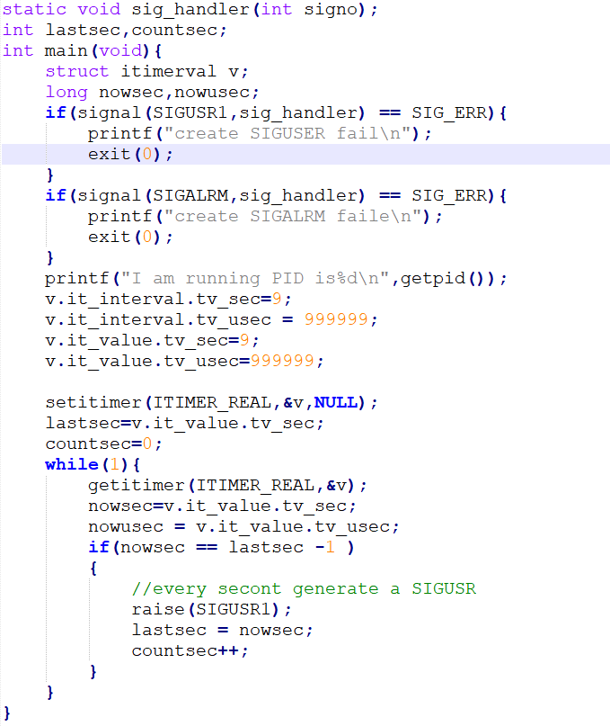

**实验目的和要求：**

1了解linux时钟中断的原理2 学习进程定时器技术

**实验条件：**

1、装有Linux操作系统的微型计算机；

## 实验过程

1 使用定时器的主要是为了周期性的执行某一任务，或者是到了一个指定时间去执行某一个任务。在工程实践中，一般有两个常见的比较有效的方法。一个是用linux内部的三个定时器，另一个是用sleep, usleep函数让进程睡眠一段时间，使用alarm定时发出一个信号，还有那就是用gettimeofday, difftime等自己来计算时间间隔，然后时间到了就执行某一任务，但是这种方法效率低，所以不常用。

#### Linux内置的3个定时器

Linux为每个任务安排了3个内部定时器：

ITIMER_REAL：实时定时器，不管进程在何种模式下运行（甚至在进程被挂起时），它总在计数。定时到达，向进程发送SIGALRM信号。

ITIMER_VIRTUAL：这个不是实时定时器，当进程在用户模式（即程序执行时）计算进程执行的时间。定时到达后向该进程发送SIGVTALRM信号。

ITIMER_PROF：进程在用户模式（即程序执行时）和核心模式（即进程调度用时）均计数。定时到达产生SIGPROF信号。ITIMER_PROF记录的时间比ITIMER_VIRTUAL多了进程调度所花的时间。

定时器在初始化是，被赋予一个初始值，随时间递减，递减至0后发出信号，同时恢复初始值。在任务中，我们可以一种或者全部三种定时器，但同一时刻同一类型的定时器只能使用一个。

用到的函数有：

\#include \<sys/time.h\>  
int getitimer(int which, struct itimerval \*value);  
int setitimer(int which, struct itimerval\*newvalue, struct itimerval\* oldvalue);  
strcut timeval  
{  
long tv_sec; /\*秒\*/  
long tv_usec; /\*微秒\*/  
};  
struct itimerval  
{  
struct timeval it_interval; /\*时间间隔\*/  
struct timeval it_value; /\*当前时间计数\*/  
};

it_interval用来指定每隔多长时间执行任务， it_value用来保存当前时间离执行任务还有多长时间。比如说， 你指定it_interval为2秒(微秒为0)，开始的时候我们把it_value的时间也设定为2秒（微秒为0），当过了一秒， it_value就减少一个为1， 再过1秒，则it_value又减少1，变为0，这个时候发出信号（告诉用户时间到了，可以执行任务了），并且系统自动把it_value的时间重置为it_interval的值，即2秒，再重新计数。

我们的实验是使用Linux定时器，来检测进程的运行时间

**必要的头文件**

**参考代码：**

**Main函数：**

**信号处理函数：**

**发送Alarm信号给进程**

## 实验结果分析

1、熟悉并记录命令执行结果。

2、写出自己的心得体会。3. 实验报告仅提供封面，不提供正文模板。实验报告要求如下：

1）至少包含实验过程、实验结果、选择部分度量项目对结果进行简要解释。

2）报告章节要组织合理。

**核心思想是：根据参考案例，结合教材，了解makefile。结合操作系统的知识，你能进一步的结合man手册计算出进程的运行时间吗？**
