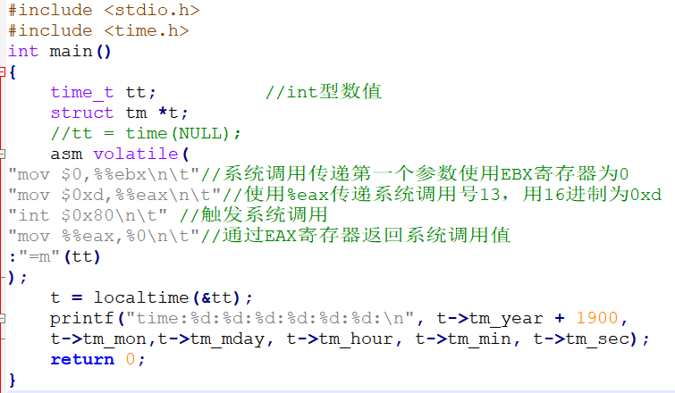
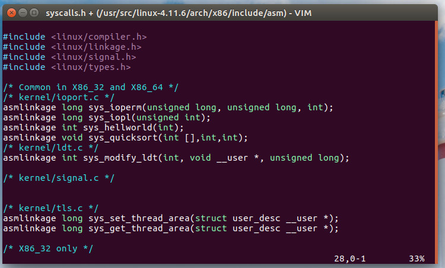

**实验目的和要求：**

1了解Linux系统调用

2仔细分析汇编代码调用系统调用的工作过程，特别是参数的传递方式等。

3总结部分需要阐明自己对“系统调用的工作机制”的理解。

**实验条件：**

1、装有Linux操作系统的微型计算机；

## 实验过程

系统调用的库函数就是读者使用的操作系统提供的 API（应用程序编程接口）， API 只是函数定义。系统调用是通过软中断向内核发出了中断请求， int 指令的执行就会触发一个中断请求。 libc 函数库定义的一些 API 内部使用了系统调用的封装例程，其主要目的是发布系统调用，使程序员在写代码时不需要用汇编指令和寄存器传递参数来触发系统调用。一般每个系统调用对应一个系统调用的封装例程，函数库再用这些封装例程定义出给程序员调用的 API，这样把系统调用最终封装成方便程序员使用的库函数。

libc 提供的 API 可能直接提供一些用户态的服务，并不需要通过系统调用与内核打交道，比如一些数学函数等，但涉及与内核空间进行交互的 API 内部会封装系统调用。一个 API 可能只对应一个系统调用，也可能内部由多个系统调用实现，一个系统调用也可能被多个 API调用。不涉及与内核进行交互的 API 内部不会封装系统调用，比如用于求绝对值的数学函数abs()。对于返回值，大部分系统调用的封装例程返回一个整数，其值的含义依赖于对应的系统调用，返回值−1 在多数情况下表示内核不能满足进程的请求， libc 中进一步定义的 errno 变量包含特定的出错码。

下面调用系统库函数 time()来获取系统的时间，即使用库函数 API time() 来获取系统

当前时间作为一个范例，通过代码和实践来进一步理解和体会系统调用。接下来我们会

通过系统库函数和直接使用嵌入式汇编代码两种方式，来触发同一个系统调用获取当前

系统时间。

**要求根据上述知识，结合课程内容设计一个time的系统调用**

**  
参考解答：**

**实验2 使用asm完成：**

**请结合上面的例子，实现rename的系统调用**。

**提高部分（添加一个自定义的系统调用（全部完成可以获得附加分）**）

系统调用（System Call）是操作系统为在用户态运行的进程与硬件设备（如CPU、磁盘、打印机等）

我们需要完成：

下载最新版本的Linux内核源代码，在Linux系统中解压缩，大致观察内核源代码的组成结构。然后编译这个版本的内核代码，并尝试用编译出的内核重新引导系统。

添加一个新的系统调用，完成任意一个功能，重新编译和运行内核，使新的系统调用可用。

编写一个用户态的程序，使用增加的系统调用，以证明它确实可以用。

开发环境：

Linux 发行版 [Ubuntu](http://www.linuxidc.com/topicnews.aspx?tid=2) 16.10

Linux 内核版本 4.11.6

虚拟机分配内存：4GB

虚拟机分配空间：50GB SSD

1.​ 在虚拟机上安装Ubuntu 16.10;

1.png

2\. 进入Ubuntu系统，更新软件源代码.

*sudo apt-get install update ​*

3. 下载编译过程中的所需的软件依赖包.

*sudo apt-get install libncurses5-dev libssl-dev*

*sudo apt-get install build-essential openssl*

*sudo apt-get install zlibc minizip*

*sudo apt-get install libidn11-dev libidn11*

4\. 通过git下载Linux 内核 4.11.6.

*git clone git://git.kernel.org/pub/scm/linux/kernel/git/stable/linux-stable.git*

5.以root管理权限解压内核到 */usr/src/*.

*sudo cd /usr/src*

*sudo tar -xvf linux-4.11.6.tar.xz*

6\. Ubuntu安装Vim编辑器.

*sudo apt-get install vim*

7.用Vim打开*/kernel/sys.c*文件，加入*linkage.h*的头文件,在文件末尾加入要加入的系统调用函数.

*sudo vim linux-4.11.6/kernel/sys.c*

2.png

3.png

8.加入系统调用函数声明。在*linux-4.11.6/arch/x86/include/asm/syscalls.h*中加入*asmlinkage void sys_quicksort(int [],int,int);*

*sudo vim linux-4.11.6/arch/x86/include/asm/syscalls.h*

4.png

9.加入系统调用号。在*linux-4.11.6/arch/x86/entry/syscalls/syscall_64.tbl*

*sudo vim linux-4.11.6/arch/x86/entry/syscalls/syscall_64.tbl*

5.png

10\. 编译内核和安装内核.

*sudo make mrproper*

*sudo make clean*

*sudo make menuconfig*

11\. 根据自己处理器的最大线程数目来编译.

*sudo make -j4*

12\. 编译后安装内核到系统中.

*sudo make modules_install*

*sudo make install*

13\. 重启加载内核.

6.png

14\. 编写程序验证系统调用.

*\#include\<stdio.h\>*

*\#define QUICK_SORT 334*

*int main()*

*{*

*int i,a[]={9,20,36,10,1,2,6,4,5,8};*

*syscall(QUICK_SORT,a,0,9);*

*for(i=0;i\<10;i++)*

*{*

*printf(“%d\\t”,a[i]);*

*}*

*return 0;*

*}*

15\. 编译C程序:

gcc -o test test.c

./test

.调用成功！

## 实验结果分析

1、熟悉并记录命令执行结果。

2、写出自己的心得体会。3. 实验报告仅提供封面，不提供正文模板。实验报告要求如下：

1）至少包含实验过程、实验结果、选择部分度量项目对结果进行简要解释。

2）报告章节要组织合理。
