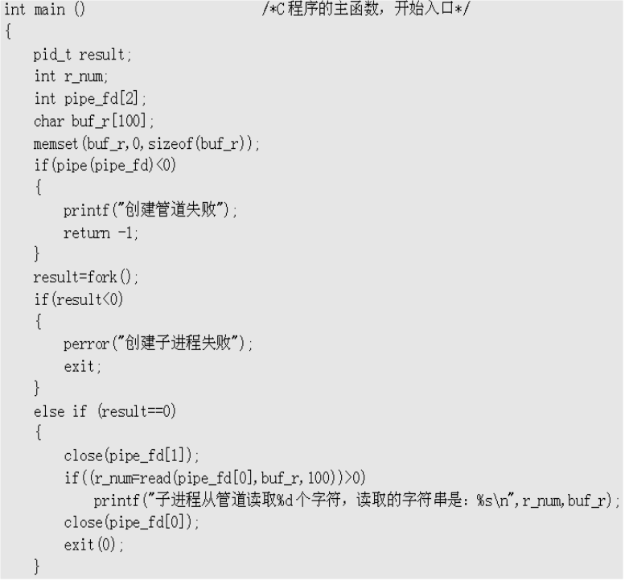
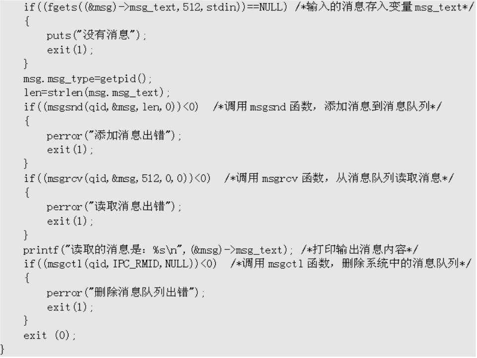

**实验目的和要求：**

进程通信中信号概念及信号处理进程间的管道通信编程进程间的内存共享编程

**实验条件：**

1、装有Linux操作系统的微型计算机；

## 实验过程

****

管道

****

****

**命名管道**

****

****

消息队列

****

## 实验结果分析

1、熟悉并记录命令执行结果。

2、写出自己的心得体会。3. 实验报告仅提供封面，不提供正文模板。实验报告要求如下：

1）至少包含实验过程、实验结果、选择部分度量项目对结果进行简要解释。

2）报告章节要组织合理。

**核心思想是：根据参考案例，结合教材，了解makefile。结合操作系统的知识，你能根据学过的知识，实现linux进程通信的互斥案例吗？**
